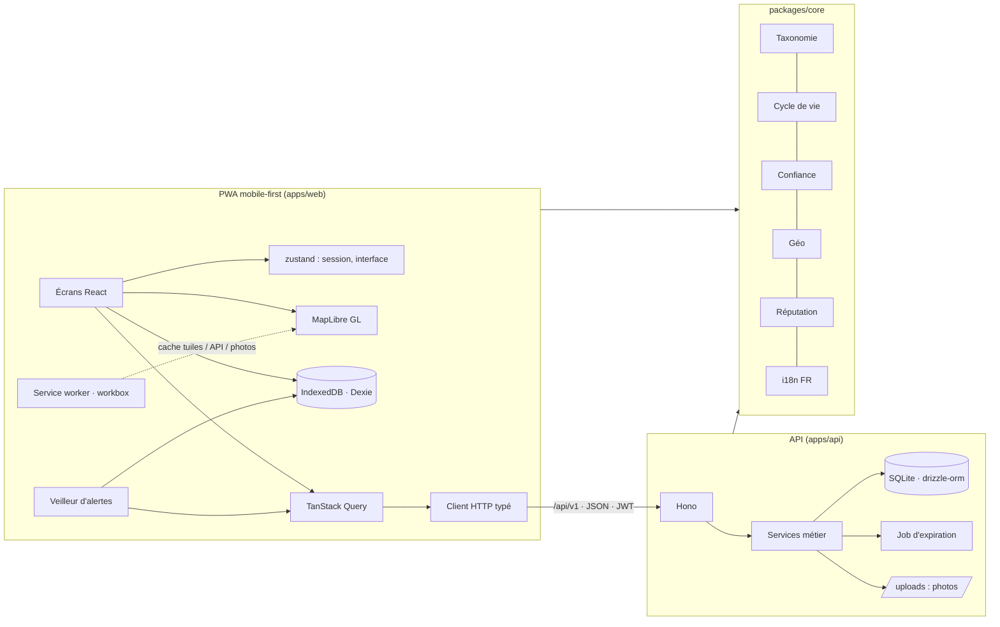
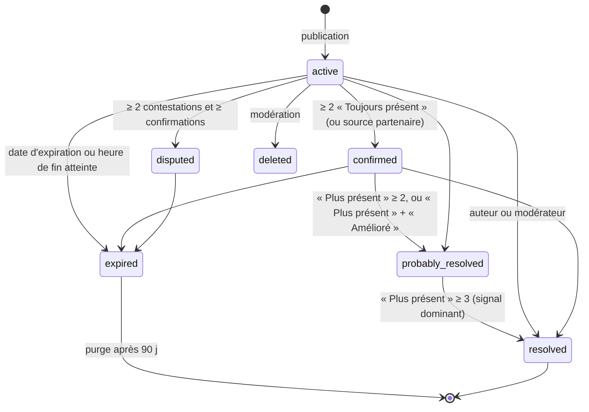
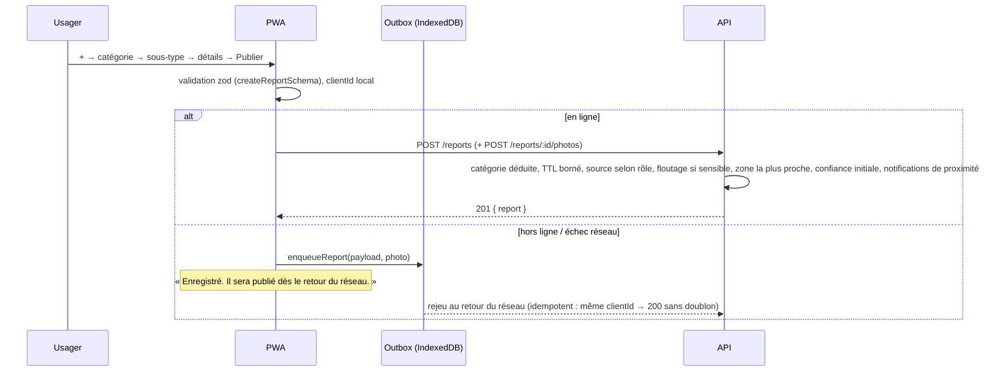

# Architecture

## Vue d'ensemble

Trois paquets pnpm :

| Paquet | Rôle | Choix techniques |
| --- | --- | --- |
| `@mountain-live/core` | **Contrat unique** partagé par le client et le serveur : types de domaine, taxonomie des signalements, schémas de validation zod, contrat d'API documenté, règles métier pures (expiration, statuts, confiance, floutage, réputation), chaînes françaises | TypeScript strict, aucune dépendance d'exécution hormis zod, 104 tests vitest |
| `@mountain-live/api` | API REST `/api/v1` | Hono (léger, portable), drizzle-orm + better-sqlite3 (MVP), JWT HS256 (`hono/jwt`), scrypt (`node:crypto`), migrations SQL idempotentes, seed Corse |
| `@mountain-live/web` | PWA installable | Vite 6, React 19, react-router 7, Tailwind 4 (tokens), MapLibre GL 5, TanStack Query 5, zustand, Dexie, vite-plugin-pwa (workbox) |

### Pourquoi ces choix

- **PWA d'abord** : un seul code pour le web et les téléphones (installable, plein écran, hors connexion, GPS, caméra). Le passage aux stores se fait ensuite avec Capacitor sans réécriture (voir [MOBILE.md](MOBILE.md)).
- **MapLibre + tuiles ouvertes** : rendu vectoriel/raster performant, fonds topographiques (OpenTopoMap avec courbes de niveau), satellite (Esri), relief (ombrage calculé à partir des tuiles d'altitude AWS Terrarium), clustering natif, images de marqueurs générées depuis les icônes lucide.
- **SQLite pour le MVP** : zéro service à opérer sur un territoire pilote ; schéma et requêtes conçus pour migrer vers PostgreSQL/PostGIS (voir [DATA_MODEL.md](DATA_MODEL.md)).
- **Contrat partagé** : les mêmes types et schémas valident les formulaires côté client et les entrées côté serveur ; la taxonomie (libellés, icônes, durées de vie) est la source de vérité des deux côtés.

## Taxonomie et durées de vie

Six catégories (`danger`, `path`, `activity`, `animals`, `water`, `crowd`) et 46 sous-types dans `packages/core/src/taxonomy.ts`. Chaque sous-type porte : libellé FR, icône, durée de vie par défaut et bornes, demande de niveau de danger, demande d'heure de fin, caractère sensible (floutage), caractère récurrent, priorité d'affichage selon le zoom.

| Sous-type | Défaut | Bornes | Particularités |
| --- | --- | --- | --- |
| Éboulement | 14 j | 2 j – 60 j | niveau de danger, priorité 3 |
| Arbre tombé | 5 j | 1 j – 30 j | niveau de danger |
| Chemin effondré | 14 j | 2 j – 90 j | niveau de danger |
| Crue | 12 h | 2 h – 3 j | niveau de danger |
| Neige / névé · Verglas | 3 j · 1 j | 12 h – 30 j · 6 h – 7 j | niveau de danger |
| Incendie | 12 h | 2 h – 7 j | niveau de danger |
| Chemin fermé · Travaux · Restriction d'accès | 7 j · 7 j · 14 j | jusqu'à 180–365 j | heure/date de fin |
| Chasse en cours · Battue | 6 h | 1 h – 14 h | heure de fin (prime sur la durée) |
| Troupeau · Bovins · Chevaux | 4 h · 4 h · 3 h | 1 h – 24 h | |
| Chiens de protection | 6 h | 1 h – 3 j | niveau de danger, priorité 3 |
| Animaux sauvages · Autre observation | 2 h | 1 h – 3 h | **sensibles : position floutée** |
| Source sèche | 5 j | 1 j – 30 j | priorité 3 |
| Source / Fontaine / Point d'eau / Refuge / Abri | 30–365 j | | récurrents (reconfirmés), prolongés par « Toujours présent » |
| Fréquentation (randonneurs, cavaliers, VTT…) | 1 h 30 – 2 h | 1 h – 3 h | |

## Cycle de vie d'un signalement (core/lifecycle.ts)

- **Expiration** : `computeExpiresAt` — pour les sous-types à heure de fin, la date saisie prime ; sinon `maintenant + durée bornée`. Le job `apps/api/src/jobs/expire.ts` passe toutes les 60 s (statut `expired`, purge de la présence de plus de 30 min, purge des signalements terminés de plus de 90 jours).
- **Estompage** : `computeFade` renvoie 1 pendant 60 % de la vie puis décroît linéairement jusqu'à 0,35 ; la carte applique cette opacité aux icônes.
- **Statuts officiels** : une source officielle reste `confirmed` tant qu'elle n'est ni expirée ni retirée ; la communauté ne peut ni la contester ni la « résoudre » (section 27).
- **Un vote par utilisateur** : revoter remplace le vote ; « Toujours présent » prolonge la durée (moitié de la durée par défaut, durée complète pour les récurrents, sans dépasser la borne ni l'heure de fin).

## Score de confiance (core/confidence.ts)

`score = base(source) + bonus réputation + confirmations − contestations − « plus présent »`, borné à 0..100, avec un plancher par source.

| Composante | Règle |
| --- | --- |
| Base | officiel 90 · partenaire 60 · communauté 25 |
| Réputation du contributeur | (niveau − 1) × 3 |
| Confirmations | pondérées par le niveau du votant (0,6..1,4) et par une **décroissance de récence** (demi-vie = 25 % de la durée de vie du sous-type, bornée 1 h..7 j), rendement décroissant : 45 × (1 − e^(−u/4)) |
| Contestations | −12 chacune, bornées à −45 |
| « Plus présent » | −6 chacun, bornés à −30 |
| Plancher | officiel ≥ 85 · partenaire ≥ 50 |

Libellés : ≥ 85 **Très fiable**, ≥ 60 **Confirmé**, ≥ 35 **Probable**, sinon **Faible confiance**.

## Réputation (core/reputation.ts)

Score interne (jamais affiché) : 3 × signalements confirmés + confirmations utiles − 4 × contestés − 10 × sanctions + ancienneté (0..5). Niveau 1..5 par seuils (0, 10, 30, 80, 200) avec plafonds : compte de moins de 7 jours → niveau ≤ 2, moitié des signalements contestés → ≤ 2, sanctions → ≤ 3 puis 1. Seul le **niveau** est public (`ReliabilityLevel`). Badges : Éclaireur (1 signalement), Contributeur (10 contributions), Expert local (25 confirmés dans la même zone), Sentinelle (50 confirmations utiles), Partenaire vérifié.

## Flux principaux

### Publication d'un signalement

### Consultation de la carte

`useReports(bbox, zoom)` interroge `GET /reports?bbox&categories&source&lat&lng` sur une emprise élargie de 30 % alignée sur une grille (clé de cache stable), rafraîchit toutes les 60 s, écrit les résultats dans Dexie et s'y replie hors ligne. La couche `ReportsLayer` construit une source GeoJSON clusterisée (rayon 48 px, jusqu'au zoom 13), filtre par priorité (zoom < 10 : priorité 3 seulement ; < 12 : priorité ≥ 2) et applique l'opacité `fade`.

### Recherche de lieux

`GET /areas/search` interroge la table `areas` (recherche insensible aux accents sur le nom et les noms alternatifs), qui contient le jeu de démonstration et, après `geo:import`, le référentiel GeoNames du territoire (lieux-dits, hameaux, communes, sommets, cols, refuges, lacs, sources, sentiers). Quand la base répond peu, `services/geocoder.ts` interroge en parallèle les index « poi » et « address » (communes) du géocodeur IGN Géoplateforme avec un délai de 4 s, fusionne les résultats sans doublon (`mergeAreaResults`) et mémorise les lieux trouvés dans `areas` avec un identifiant stable dérivé du nom et de la position, pour que `/areas/:id` et les recherches suivantes fonctionnent, y compris hors ligne côté serveur.

### Alertes de proximité et présence

`AlertsWatcher` (monté une fois) : à chaque déplacement de plus de 50 m ou toutes les 20 s, `computeAlerts` compare la position aux signalements connus (caches TanStack + Dexie) dans le rayon et les catégories des préférences ; regroupe troupeau + chiens de protection ; les alertes officielles priment ; chaque alerte n'est émise qu'une fois par 6 h ; toast persistant avec « Voir », vibration, notification système si l'onglet est masqué. Toutes les 5 minutes au plus, `POST /presence` envoie la position : le serveur ne stocke que la **cellule ≈1 km** et une tranche de 5 minutes, sans identifiant, purgée après 30 minutes ; `GET /presence?bbox` alimente la carte thermique et « Environ N utilisateurs actifs ».

### Hors connexion

Trois mécanismes complémentaires :

1. **Service worker** (workbox `generateSW`) : précache de l'application ; tuiles cartographiques en cache-first 60 jours ; photos en cache-first ; API en network-first avec repli cache.
2. **Zones téléchargées** : `downloadZone` récupère `GET /offline/bundle?bbox` (signalements, alertes, sentiers, points d'eau, lieux) puis précharge les tuiles OpenTopoMap des zooms 10 à 15 dans le cache `map-tiles` (limite 4 000 tuiles, ≈25 Ko/tuile) ; les zones sont listées, mises à jour et supprimées (tuiles non partagées purgées).
3. **File d'attente** (`lib/outbox.ts`, `features/offline/sync.ts`) : créations et confirmations rejouées au retour du réseau, au démarrage et toutes les 2 minutes ; abandon après 5 tentatives ou erreur définitive.

## Tests

- `packages/core` : règles métier (TTL, expiration, statuts, confiance monotone, plancher officiel, floutage déterministe < rayon, distances, formats FR).
- `apps/api` : base SQLite temporaire par test — inscription/connexion, création (TTL borné, catégorie déduite, floutage), liste par bbox, confirmation (un vote, interdite à l'auteur, statut confirmé), expiration, présence sans identifiant, permissions admin, suppression RGPD, bundle hors ligne, photos.
- `apps/web` : composants du design system (icônes de la taxonomie résolues, badges, boutons, coquille), GeoJSON et filtre de zoom, état de l'assistant, confirmation, partage, formulaire d'inscription, tuiles hors connexion, moteur d'alertes, CSV/graphiques.
- Parcours de bout en bout (Chromium headless 390×844) : onboarding → carte → recherche → filtres → fiche → autour de moi → explorer → connexion → publication → confirmation → profil → préférences → notifications → hors connexion → back-office → tableau de bord pro.

## Extensions prévues

- **Itinéraires (section 13)** : `trails` en base (LineString), `distanceToPolylineM` et `pointsAlongLine` dans `core/geo.ts`, notification `new_danger_on_route` déjà typée ; il reste le calcul d'itinéraire, le profil altimétrique et l'écran.
- **B2B (section 18)** : `/pro/dashboard` et l'écran existent ; à venir : comptes multi-utilisateurs par organisation, historique long, exports planifiés, import open data.
- **Notifications push** : les types et préférences existent ; il manque le canal (Web Push / FCM).
