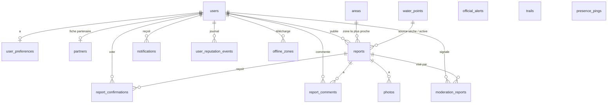

# Modèle de données

Base SQLite (`apps/api/data/mountain-live.db`), schéma drizzle dans `apps/api/src/db/schema.ts`, migrations SQL idempotentes dans `apps/api/src/db/migrate.ts` (exécutées au démarrage et par `db:migrate`).

## Tables

| Table | Rôle | Champs notables |
| --- | --- | --- |
| `users` | comptes | `email` (unique, jamais exposé), `password_hash` (scrypt), `pseudo` (unique, insensible à la casse), `practices` (JSON), `region`, `role` (user, partner, official, moderator, admin), `reputation_score` (interne), `reliability_level` (1..5), `reports_count`, `confirmations_count`, `badges` (JSON), `consent_given_at`, `suspended_until`, `deleted_at` |
| `user_preferences` | préférences (filtres, fond, thème, alertes, notifications, rayon) | `user_id` PK, JSON |
| `partners` | fiche des comptes partenaires / officiels | organisation, type, vérifié |
| `reports` | **signalements** (section 25) | voir ci-dessous |
| `report_confirmations` | votes (un par utilisateur et par signalement) | `kind` (still_present, improved, gone, disputed), `comment` ; unique (`report_id`, `user_id`) |
| `report_comments` | commentaires | `body`, `deleted_at` |
| `photos` | photos des signalements | `url` relative `/uploads/…`, dimensions, `deleted_at` |
| `official_alerts` | alertes officielles | `organisation`, `title`, `body`, `category`, `severity`, `geometry` (GeoJSON Point/Polygon), `centroid_lat/lng`, `starts_at`, `ends_at`, `url` |
| `trails` | sentiers de référence | `type`, `difficulty`, `distance_km`, `elevation_gain_m`, `geometry` (LineString) |
| `paths` | **réseau de chemins** = segments du graphe (`TRAIL_SEGMENTS` du moteur collectif) : une arête, intersections aux extrémités | `kind` (path, track, footway, bridleway, cycleway, steps, road, via_ferrata), `name`, `surface`, `sac_scale`, `width_m`, `foot` / `bicycle` / `horse`, `ford`, `status` (open / closed), `coordinates` (JSON `[lng, lat][]`), `elevations`, `length_m`, `source` (osm, ign, seed, gpx, local), emprise `min/max_lat/lng`. Moteur collectif : `trail_id`, `start_node` / `end_node`, `elevation_gain_m` / `loss_m`, `average_slope`, `max_slope`, `difficulty`, `community_confidence`, `passage_count`, `last_passage_at`, `popularity_score`, `version`. Identifiants : `d_…` réseau de démonstration, `osm_<way>[_n]` import OpenStreetMap (`geo:import-osm`) |
| `water_points` | sources, fontaines, lacs, refuges, abris | `type`, `last_state` (active, dry, unknown), `last_state_at`, `elevation` |
| `areas` | lieux recherchables | `type` (commune, massif, trail, summit, pass, place, refuge, lake, hamlet, spring), `lat/lng`, `bbox`, `elevation`, `description`, `commune` (commune de rattachement, pour distinguer les homonymes). Identifiants : `a_…` jeu de démonstration, `gn_<geonameid>` import GeoNames (`geo:import`), `g_…` lieux mémorisés depuis le géocodeur IGN |
| `activities` | **activités enregistrées** (moteur collectif) | `user_id` (détaché à la suppression du compte), `activity_type`, `started_at`, `ended_at`, `distance_m`, `duration_ms`, `elevation_gain_m/loss_m`, `point_count`, `quality_score`, `matched_ratio`, `contribution` (private / contributed / withdrawn), `contributed_at`, `processed_at`, `raw_purged_at`, emprise |
| `activity_points` | **trace brute**, jamais modifiée (section 5) | `activity_id` + `seq` (clé primaire), `at` (ms), `lat`, `lng`, `alt`, `accuracy`, `speed`, `heading`, `quality` (0–5). Purgée après 90 jours |
| `activity_matched_points` | **trace rattachée** au réseau (section 8) | `activity_id` + `seq`, `segment_id` (null hors réseau), position projetée, `along`, `confidence`, `deviation_m` |
| `segment_traversals` | **passages** sur un segment | `segment_id`, `activity_id`, `user_key` (pseudonyme HMAC, jamais l'identifiant du compte), `activity_type`, `direction`, `entered_at` / `exited_at` (interpolés), `duration_ms`, `distance_m`, `coverage`, `average_speed_ms`, `confidence` |
| `segment_statistics` | **agrégats publiables** | clé (`segment_id`, `activity_type` ou `all`, `direction` ou `both`) ; passages 7/30/365/total, utilisateurs et sessions distincts, moyenne / médiane / p25 / p75, dispersion, popularité 0–100, niveau de fréquentation, confiance, `insufficient_data`, répartitions mensuelle et horaire, tendance, `possibly_inactive` |
| `network_candidates` | **propositions du terrain** soumises à modération | `kind` (new_trail, geometry, variant, slow_zone, turnaround, confusion, inactive), `geometry`, `detail`, `observations`, `unique_users`, `confidence`, `status`, décision (`reviewed_by`, `reviewed_at`, `review_note`) |
| `segment_versions` | **historique des géométries** (section 47) | `segment_id` + `version` (unique), `coordinates`, `source`, `reason`, `confidence`, `author`, `created_at` |
| `user_pace` | allure personnelle observée (facultative) | `user_id` + `activity_type`, `factor`, `samples` |
| `privacy_zones` | zones dont les traces ne sortent jamais | `user_id`, `lat`, `lng`, `radius_m`, `label` |
| `offline_zones` | zones téléchargées par un utilisateur (métadonnées) | `bbox`, `downloaded_at` |
| `notifications` | notifications in-app | `type`, `title`, `body`, `report_id`, `read_at` |
| `user_reputation_events` | journal interne de réputation | `kind`, `delta`, `report_id` |
| `moderation_reports` | signalements de contenu (ContentFlag) | `reason` (6 motifs), `status` (open, reviewing, resolved, rejected), cible (`report_id` / `comment_id` / `photo_id`), `resolution_note`, `resolved_by` |
| `presence_pings` | **présence agrégée** | `cell` (≈1 km, arrondi 0,01°), `bucket_start` (tranche de 5 min), `count` — **aucun identifiant, aucune position précise** ; purge après 30 min |
| `schema_migrations` | versions appliquées | |

### Dictionnaire de `reports`

| Champ | Type | Description |
| --- | --- | --- |
| `id` | texte | identifiant (nanoid) |
| `user_id` | texte, nullable | auteur (null après suppression du compte) |
| `category`, `subtype` | texte | catégorie déduite du sous-type (taxonomie) |
| `lat`, `lng` | réel | position exacte (jamais renvoyée si `blurred`) |
| `display_lat`, `display_lng`, `blurred` | réel, booléen | position servie ; floutée sur une grille de 0,005° dans un rayon ≤ 400 m pour les espèces sensibles |
| `danger_level` | texte, nullable | low, moderate, high, critical |
| `description` | texte ≤ 600 | |
| `zone` | texte | lieu le plus proche (≤ 8 km) ou saisi |
| `source` | texte | official, partner, community (déduite du rôle de l'auteur) |
| `status` | texte | active, confirmed, probably_resolved, resolved, expired, disputed, deleted |
| `created_at`, `updated_at`, `expires_at`, `starts_at`, `ends_at` | ISO 8601 | expiration calculée par `computeExpiresAt` |
| `confirmations_count`, `disputes_count`, `resolved_votes_count`, `improved_votes_count`, `last_confirmation_at` | compteurs | recalculés à chaque vote |
| `confidence_score`, `confidence_label` | 0..100, libellé | `computeConfidence` / `confidenceLabel` |
| `resolved_at`, `deleted_at` | ISO 8601 | |
| `client_id` | texte unique nullable | idempotence de la file hors connexion |

Index : (`lat`, `lng`), `status`, `expires_at`, `category`, `created_at`, `user_id`, `client_id`.

## Statuts et transitions

Voir [ARCHITECTURE.md](ARCHITECTURE.md#cycle-de-vie-dun-signalement-corelifecyclets). Les statuts **visibles** sur la carte sont `active`, `confirmed`, `probably_resolved`, `disputed` (non expirés). `resolved` et `expired` restent consultables par leur identifiant et dans le back-office ; `deleted` n'est visible que des modérateurs.

## Politique de rétention

| Donnée | Durée |
| --- | --- |
| Présence agrégée | 30 minutes |
| Signalements résolus / expirés | 90 jours puis purge (`expiredRetentionDays`) |
| Compte | jusqu'à suppression par l'utilisateur (anonymisation immédiate) |
| Photos | suivent le signalement |
| Jeton de session | 30 jours |

## Migration vers PostgreSQL / PostGIS

Le schéma est volontairement plat et portable : identifiants texte, dates ISO, JSON pour les listes. Pour un déploiement à l'échelle :

1. Remplacer `better-sqlite3` par `pg` (drizzle-orm supporte les deux ; les requêtes sont écrites avec le query builder).
2. Ajouter une colonne `geom geometry(Point, 4326)` sur `reports`, `water_points`, `areas`, `presence_pings` et `geom geometry(Polygon, 4326)` sur `official_alerts`, avec index GiST.
3. Remplacer les filtres par bbox (`lat BETWEEN … AND lng BETWEEN …`) par `ST_Intersects(geom, ST_MakeEnvelope(...))` et les rayons (`haversineM` en mémoire) par `ST_DWithin(geom::geography, point::geography, radius)`.
4. Stocker les photos sur un stockage objet (S3 compatible) au lieu du dossier `uploads/`.
5. Remplacer la présence en mémoire (alertes de proximité) par une table ou Redis avec TTL.
